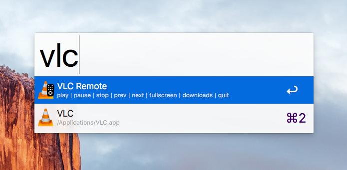

# Alfred VLC Remote

## Contents
<!-- MarkdownTOC -->

- [Usage](#usage)
- [Todo](#todo)
- [Installation](#installation)
- [License & Acknowledgements](#license--acknowledgements)

<!-- /MarkdownTOC -->

## Usage

Activate the remote via the `vlc` keyword, followed by the action you want to do:

- `play` / `pause`: toggles between playback and pause
- `stop`: exit out of playback and show the playlist
- `next`: next song or chapter
- `prev`: previous song or chapter
- `fullscreen`: toggles fullscreen
- `downloads`: loads all content of your user's Downloads folder into VLC's playlist
- `volup`: increases volume by one increment (of 32)
- `volup`: decreases volume by one increment (of 32)
- `volmax`: maxes out VLC's volume (use with care)
- `mute`: toggles mute
- `delayup`: increases audio delay by 50ms
- `delaydown`: decreases audio delay by 50ms
- `subs`: toggles through the available subtitles
- `quit`: quits VLC

## Todo
- [x] Test all workflows
- [ ] Remove `downloads` command
- [ ] Add a generalized `open` folder command
    - [ ] Alfred api to search folders / songs?
- [ ] When searching normally in alfred, add action to open in vlc?
- [ ] Interaction with VLC Media library?

## Installation

- Prerequisites
    - Alfred 3
    - Alfred Powerpack
    - VLC
    - Optional: Alfred Remote iPhone app
- Download `vlc-remote.alfredworkflow`
- Import it into your collection of Alfred workflows by double clicking it

## License & Acknowledgements
This is an update version of the original
[vlc remote workflow](https://github.com/geberl/alfred-vlc-remote) by [Günther Eberl](https://github.com/geberl).  
All code is under the GPLv3 License.

Many thanks to:

- [Thread on Alfred forums](https://www.alfredforum.com/topic/10027-vlc-remote/)
- [jeroenbegyn's AppleScript](https://github.com/jeroenbegyn/VLCControl) to control VLC
- [Which functions of an application IO with AppleScript](https://www.safaribooksonline.com/library/view/applescript-the-definitive/0596102119/ch01s02.html)
- [Clicky Steve's Alfred VLC workflow](http://www.packal.org/workflow/vlc-remote-control)

